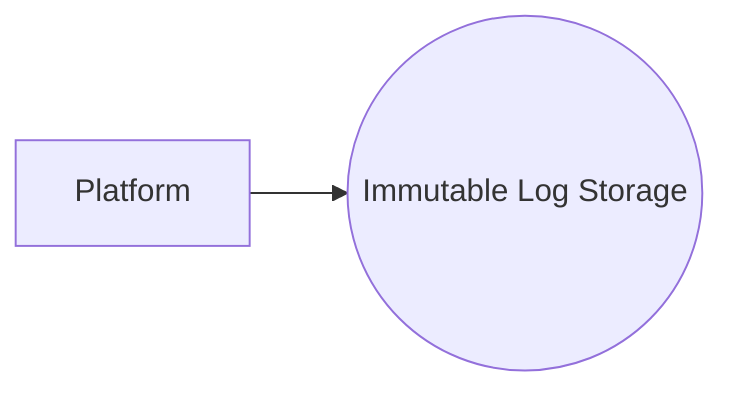

# Implement Immutable Audit Logging with Write-Once Storage

## Context

Audit logs require immutability and high availability to meet compliance and security mandates.

## Decision

Use append-only write-once storage for audit logs with hashing and digital signatures to prevent tampering.

## Rationale

Ensures audit log integrity and compliance with security standards.

## Consequences

- Storage overhead for write-once medium
- Needs secure key management for signatures
- Complexity in log retrieval and indexing

## Alternatives

- Relational DB with standard writes
- Cloud WORM storage services

## Diagram

