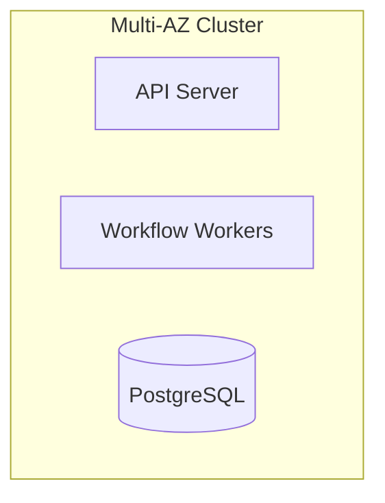

# Deploy on Kubernetes with Multi-AZ Clusters

## Context

Need resilient, scalable deployment for orchestration platform services.

## Decision

Use Kubernetes in multi-AZ setup with autoscaling and rolling updates.

## Rationale

Kubernetes provides container orchestration, self-healing, and scaling capabilities.

## Consequences

- Require Kubernetes ops expertise
- Infrastructure cost for multi-AZ clusters

## Alternatives

- Docker Swarm
- Serverless Functions

## Diagram

