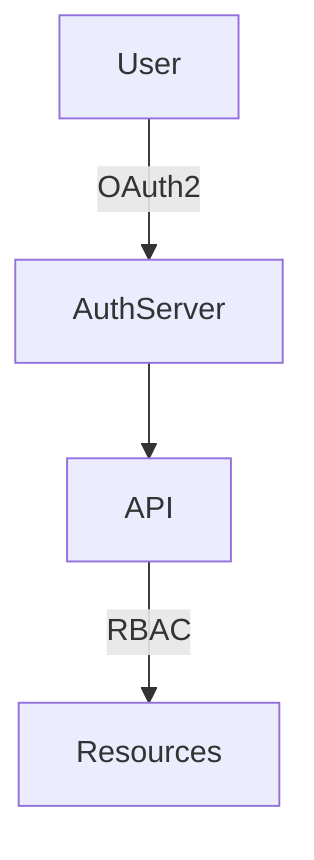

# Use OAuth2 with RBAC for Authentication and Authorization

## Context

User role management and security require strong authentication and fine-grained access control.

## Decision

Implement OAuth2 for authentication combined with Role-Based Access Control (RBAC) for authorization enforcement.

## Rationale

OAuth2 is an industry standard with good support and RBAC simplifies permission management.

## Consequences

- Requires token management
- Need to secure token storage
- RBAC needs roles and permissions design

## Alternatives

- SAML-based SSO
- Custom Authentication Service

## Diagram

