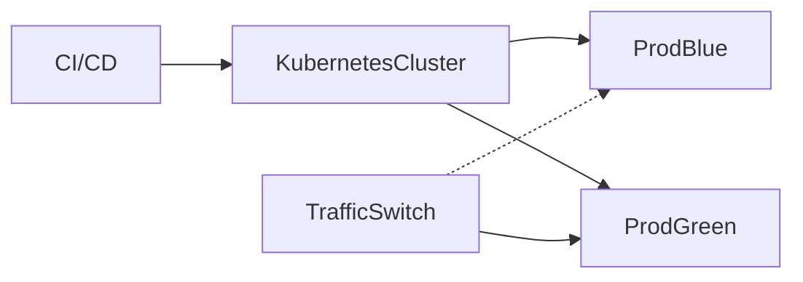

# Kubernetes Deployment with Blue-Green Strategy

## Context

Minimize downtime and risk during deployments and allow fast rollback if incidents occur.

## Decision

Use Kubernetes with blue-green deployment strategy and automated health checks.

## Rationale

Blue-green deployments minimize downtime and rollback risks.

## Consequences

- Increased infrastructure complexity
- Need CI/CD pipeline integration

## Alternatives

- Rolling updates
- Canary deployments

## Diagram

