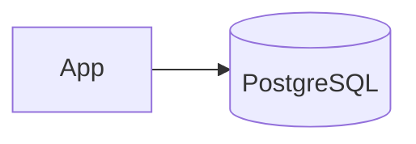

# Use PostgreSQL for BOM and Inventory Data

## Context

The system needs reliable relational DB with JSONB support for BOM and real-time inventory caching.

## Decision

Use PostgreSQL as primary data store for BOM, inventory, and configuration records.

## Rationale

PostgreSQL offers JSONB for flexible schemas and strong consistency guarantees.

## Consequences

- Requires PostgreSQL expertise
- May have higher operational overhead than NoSQL

## Alternatives

- MongoDB
- Cassandra

## Diagram

