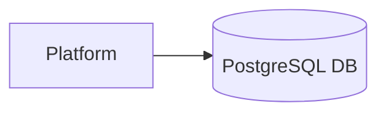

# Use PostgreSQL for SDLC Pipeline and Artifact Storage

## Context

The platform requires a reliable, scalable relational database for managing SDLC pipelines, stages, artifact versions, and audit logs.

## Decision

Use PostgreSQL as the primary persistent storage with support for JSONB columns to handle pipeline metadata and artifacts metadata.

## Rationale

PostgreSQL provides strong consistency, mature ecosystem, advanced indexing, and JSONB support for flexible schemas.

## Consequences

- Requires DB expertise
- Operational complexity for backups and scaling
- Improves complex query performance and analytics capabilities

## Alternatives

- MongoDB (NoSQL alternative)
- MySQL (less JSONB support)
- SQLite (not scalable for production)

## Diagram

