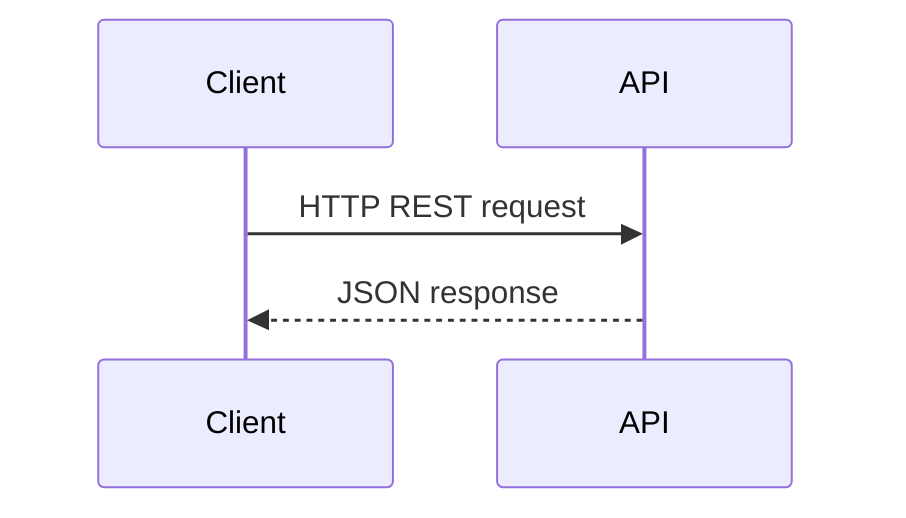

# Adopt RESTful API Design for Platform Services

## Context

SDLC platform needs well-defined external and internal APIs for pipeline and artifact management.

## Decision

Adopt RESTful API design principles with JSON over HTTPS, proper versioning, and HATEOAS where applicable.

## Rationale

REST APIs are widely adopted, easy to consume, cacheable, and allow evolution with minimal impact.

## Consequences

- Need API gateway and version management
- Requires secure token-based auth
- Designed for stateless interactions

## Alternatives

- GraphQL for flexible querying
- gRPC for internal microservices communication

## Diagram

