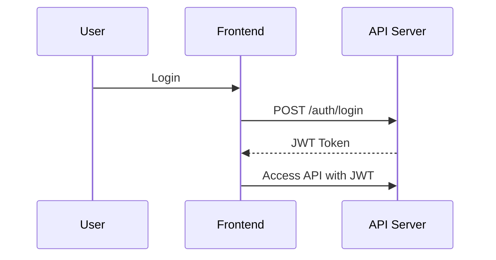

# Implement JWT-based Authentication and Authorization

## Context

System must authenticate users and enforce role-based access control securely and efficiently.

## Decision

Adopt JSON Web Tokens (JWT) for stateless authentication and RBAC enforcement.

## Rationale

JWT allows scalable stateless session handling and easy integration with client apps.

## Consequences

- Tokens need secure storage and validation
- Require token expiry and refresh policies

## Alternatives

- Session Cookies
- OAuth2 with external provider

## Diagram

