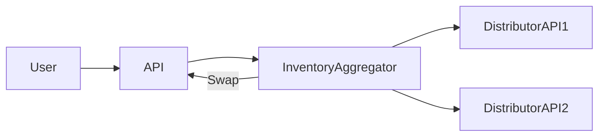

# Multi-Distributor Real-Time Inventory Lookup

## Context

To prevent ghost inventory, system must query multiple distributors in real-time and dynamically swap parts.

## Decision

Implement an async aggregator service that concurrently queries multiple distributor APIs and applies business rules for part equivalence swapping.

## Rationale

Async queries with concurrency maximize responsiveness and fresher inventory data.

## Consequences

- Complex coordination logic
- Need to handle partial failures gracefully

## Alternatives

- Batch nightly refresh
- Single distributor API

## Diagram

