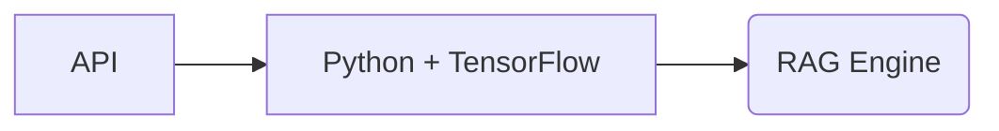

# Use Python and TensorFlow for NLP and RAG

## Context

The system requires advanced natural language processing to parse user inputs and retrieve technical manuals in real-time.

## Decision

Adopt Python with TensorFlow for NLP models and RAG implementation.

## Rationale

Python has strong ML ecosystem and TensorFlow supports latest NLP techniques with good performance.

## Consequences

- Requires Python runtime infrastructure
- Need ML expertise in team

## Alternatives

- Java with Deeplearning4j
- Go with custom ML services

## Diagram

