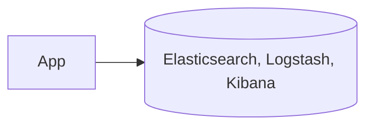

# Use ELK Stack for Centralized Logging and Monitoring

## Context

Platform requires observability into system events and audit logs.

## Decision

Adopt Elasticsearch, Logstash, and Kibana (ELK Stack) for log aggregation and visualization.

## Rationale

ELK Stack is widely used for scalable log analytics and alerting.

## Consequences

- Operational overhead for ELK maintenance
- Need to ensure log pipeline is secured

## Alternatives

- Splunk
- Prometheus with Grafana

## Diagram

