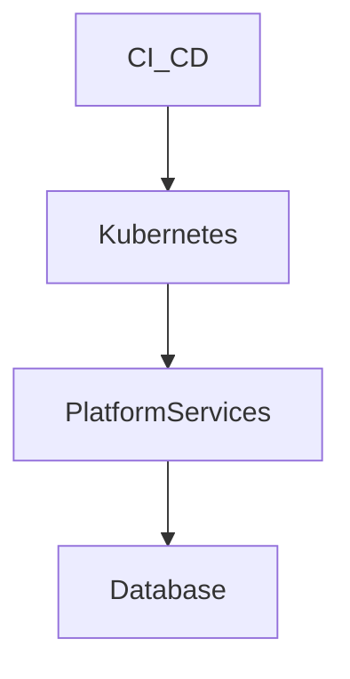

# Deploy Platform on Kubernetes with CI/CD Pipelines

## Context

The platform needs to support scalable, reliable deployment environments with minimal downtime.

## Decision

Deploy platform microservices as Docker containers managed by Kubernetes clusters with rolling updates and CI/CD pipelines for automation.

## Rationale

Kubernetes provides scalability, health management, and zero-downtime deployment benefits.

## Consequences

- Operational complexity
- Requires containerization of apps
- Need solid monitoring and logging

## Alternatives

- VM-based deployments
- Serverless platform with AWS Lambda

## Diagram

