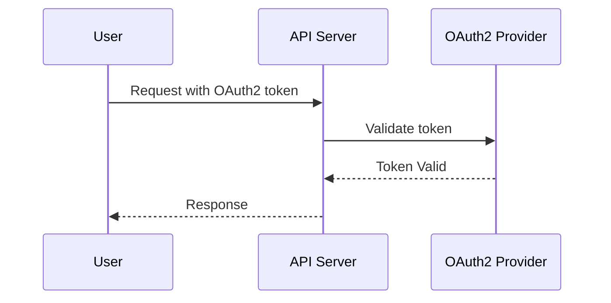

# RESTful API Design with OAuth2 Security

## Context

APIs must be secure, scalable, and support role-based access control.

## Decision

Design RESTful APIs with OAuth2 for authentication and authorization.

## Rationale

OAuth2 is industry standard with broad support and extensibility.

## Consequences

- Implementation complexity
- Need token management

## Alternatives

- API keys
- JWT only without OAuth2

## Diagram

